# Life Simulation Romance Game - Development Documentation

## Project Vision

A long-term 2D life simulation + romance game built with Flutter, designed with **Clean Architecture + DDD** principles.

### Core Philosophy

- **Separation of Concerns**: Game engine (code) vs. game content (narrative data)
- **Domain-Driven Design**: Business logic independent of infrastructure
- **Narrative-First**: Enable non-technical writers to create scenarios using STAR format
- **No Big Ball of Mud**: Strict architectural boundaries prevent technical debt

---

## Quick Start

### Project Status
- **Current Phase**: Phase 0 - Architecture Design ✅ Complete
- **Next Phase**: Phase 1 - Domain Layer Implementation

### Documentation Structure

```
docs/
├── 01_game_mechanics.md          # 完整遊戲機制定義
├── 02_domain_model.md            # Domain Layer 設計
├── 03_application_layer.md       # Use Cases 定義
├── 04_infrastructure_layer.md    # 持久化與資料載入
├── 05_narrative_system.md        # STAR 格式與劇本規範
├── 06_development_roadmap.md     # 開發路線圖
└── 07_collaboration_workflow.md  # 團隊協作流程
```

---

## Core Concepts

### Game Loop
```
玩家起床 → 選擇場景 → 探索互動點 → 觸發事件 
→ 做出選擇 → 影響數值/關係 → 時間推進 → 循環
→ 週末特殊事件 → 季節轉換事件
```

### Time Progression
- **Daily**: 4 periods (morning → afternoon → evening → night)
- **Weekly**: 7 days (Monday-Sunday), week counter increments
- **Seasonal**: Event-triggered transitions (Spring → Summer → Autumn → Winter)

### Location Hierarchy
```
Root Location (e.g. Home)
├─ Sub-location (Kitchen)
│  ├─ Interaction Point (Stove)
│  └─ Interaction Point (Fridge)
└─ Sub-location (Bedroom)
   ├─ Interaction Point (Bed)
   └─ Interaction Point (Desk)
```

### Relationship Mechanics
- **Affection**: Built through positive interactions, romance routes
- **Domination**: Built through leverage items/events, control routes
  - **YAML-driven**: Writers freely define domination gain
  - Example: Photo item +20, Video event +30, Blackmail +50
  - Flexible balancing without code changes
- **Corruption**: Player stat affecting available relationship options
  - Low: Romance-focused gameplay
  - High: Domination routes unlock

### Key Features
- **Interactive Exploration**: Click objects in scenes to discover events
- **Relationship Building**: Multiple romance routes with affection & domination mechanics
- **Stat Management**: 5 core attributes (stamina, charm, intelligence, corruption, cleanliness)
- **Seasonal Events**: Spring/Summer/Autumn/Winter cycle affects available scenarios
- **Weekly Schedule**: 7-day cycle with weekday-specific events
- **Hierarchical Locations**: Nested interaction points (home > kitchen > stove)
- **Dynamic Dialogue**: Conversations change based on interaction count
- **Multiple Endings**: Non-exclusive endings for each character

---

## Technology Stack

### Core
- **Framework**: Flutter 3.x
- **Language**: Dart 3.x
- **State Management**: Riverpod 2.x

### Architecture
- **Pattern**: Clean Architecture + DDD
- **Testing**: >80% domain layer coverage target

### Persistence
- **Local Storage**: shared_preferences
- **Format**: JSON with versioning

---

## Development Phases

| Phase                | Duration   | Deliverable                                                  | Status    |
| -------------------- | ---------- | ------------------------------------------------------------ | --------- |
| 0. Architecture      | -          | Complete design docs                                         | ✅ Done    |
| 1. Domain Layer      | Week 1-2   | Core business logic (Stats, Time, Relationship, Interaction) | 📋 Next    |
| 2. Application Layer | Week 3-4   | Use cases                                                    | ⏳ Planned |
| 3. Infrastructure    | Week 5-6   | Save system                                                  | ⏳ Planned |
| 4. Presentation MVP  | Week 7-8   | Playable demo                                                | ⏳ Planned |
| 5. Vertical Slice    | Week 9-10  | 1 character route                                            | ⏳ Planned |
| 6. Tooling           | Week 11-12 | Validation tools                                             | ⏳ Planned |
| 7. Expansion         | Week 13-16 | 3 characters, 8 scenes                                       | ⏳ Planned |
| 8. Polish            | Week 17-18 | Alpha release                                                | ⏳ Planned |

---

## Team Roles

### Engineer
- Define Domain Model
- Implement game engine
- Create mapping rules (narrative_rules.yaml)
- Maintain tooling

### Writer
- Create scenarios in STAR format
- Write character dialogues
- Design event branches
- No coding required

### PM
- Review narrative quality
- Define game balance
- Request new features
- Approve content

---

## Getting Started

### For Engineers
1. Read: `02_domain_model.md`
2. Setup: Run `flutter create life_sim_game`
3. Start: Implement `Stats` value object (TDD)

### For Writers
1. Read: `05_narrative_system.md`
2. See: Example scenarios in `/scenarios/examples/`
3. Write: Use STAR template

### For PMs
1. Read: `01_game_mechanics.md`
2. Review: `06_development_roadmap.md`
3. Plan: Content schedule

---

## Key Decisions Log

### Exploration System
- ✅ Click-based interaction (not random encounters)
- ✅ Hierarchical location structure:
  - Root locations (home, park, school)
  - Sub-locations (kitchen, bedroom)
  - Interaction points (stove, bed, desk)
- ✅ No stamina cost for exploration
- ✅ NPC hints unlock hidden interaction points
- ✅ Interaction count persisted per interaction point
  - Tracks "Nth time clicking this specific point"
  - First interaction may differ from subsequent ones
  - Enables progression-based dialogue changes
  - Example: 7th visit to cafe counter = "regular customer"

### Time System
- ✅ 4 time slots per day (morning/afternoon/evening/night)
- ✅ Weekly cycle (Monday-Sunday, week counter increments)
- ✅ Seasonal events (Spring/Summer/Autumn/Winter)
  - Season changes triggered by special events (not time-based)
  - Affects available scenarios and NPC behaviors
- ✅ Stamina cannot go negative (forced rest at 0)
- ✅ Minor events don't consume time
- ✅ Major events consume time and force scene exit

### Relationship System
- ✅ Multiple simultaneous romances allowed
- ✅ Dual relationship values per character:
  - **Affection**: Mutual attraction (0-100)
  - **Domination**: Control/leverage (0-100)
- ✅ Domination system design:
  - **Numeric value** (0-100), not item counter
  - **YAML-driven gains**: Writers set delta per item/event
  - **Flexible balancing**: Different items = different effects
  - **No code changes needed**: All in scenario files
  - Example YAML:
    ```yaml
    event_blackmail:
      effects:
        - type: modify_domination
          character: alice
          delta: 30
    ```
- ✅ Leverage items enable domination routes
  - Items obtained through specific events
  - Required to unlock certain character interactions
- ✅ Corruption stat affects available relationship options
  - Characters have corruption range requirements
  - Low corruption: Romance routes only
  - High corruption: Domination routes available
- ✅ Jealousy mechanics between characters (Phase 2)

### Ending System
- ✅ Multiple non-exclusive endings
- ✅ Player triggers endings manually
- ✅ No game over condition
- ✅ Routes lock individually after ending

---

## Contact & Resources

- **Documentation**: See `/docs` folder
- **Examples**: See `/scenarios/examples` folder
- **Architecture Diagrams**: See `02_domain_model.md`

---

## Domain Design

```mermaid
classDiagram
    %% Aggregate Roots
    class GameState {
        <<Aggregate Root>>
        +Player player
        +PlayerState playerState
        +GameTime time
        +Season season
        +String currentLocationId
        +InteractionHistory interactionHistory
        +advanceTime() GameState
        +changeSeason(Season) GameState
        +moveTo(String) GameState
        +recordInteraction(String, String) GameState
        +getInteractionCount(String) int
        +modifyStat(String, int) GameState
        +modifyAffection(String, int) GameState
        +modifyDomination(String, int) GameState
    }

    class Player {
        <<Entity>>
        +String id
        +String name
        +Stats stats
        +Relationships relationships
        +Map~String,dynamic~ flags
        +modifyStat(String, int) Player
        +modifyAffection(String, int) Player
        +modifyDomination(String, int) Player
        +setFlag(String, dynamic) Player
    }

    %% Value Objects
    class GameTime {
        <<Value Object>>
        +int week
        +Weekday weekday
        +TimeOfDay period
        +advance() GameTime
        +advanceToNextDay() GameTime
        +isWeekend() bool
        +isWorkday() bool
    }

    class Stats {
        <<Value Object>>
        -Map~String,int~ _values
        +get(String) int
        +modify(String, int) Stats
        +set(String, int) Stats
        +initial()$ Stats
    }

    class Relationships {
        <<Value Object>>
        -Map~String,Relationship~ _data
        +get(String) Relationship?
        +modifyAffection(String, int) Relationships
        +modifyDomination(String, int) Relationships
        +getAll() List~Relationship~
    }

    class Relationship {
        <<Value Object>>
        +String characterId
        +int affection
        +int domination
        +modifyAffection(int) Relationship
        +modifyDomination(int) Relationship
    }

    class PlayerState {
        <<Value Object>>
        +Inventory inventory
        +String? wearing
        +Set~String~ statusEffects
        +hasItem(String) bool
        +equipItem(String) PlayerState
        +addStatus(String) PlayerState
    }

    class Inventory {
        <<Value Object>>
        -Map~String,int~ _items
        +hasItem(String) bool
        +getCount(String) int
        +addItem(String, int) Inventory
        +removeItem(String, int) Inventory
    }

    class InteractionHistory {
        <<Value Object>>
        -Map~String,InteractionRecord~ _records
        +getInteractionCount(String) int
        +hasCompletedEvent(String) bool
        +recordInteraction(String, String) InteractionHistory
    }

    class InteractionRecord {
        <<Value Object>>
        +String pointId
        +int totalInteractions
        +Set~String~ completedEvents
        +recordEvent(String) InteractionRecord
    }

    class Location {
        <<Entity>>
        +String id
        +String? parentId
        +isChildOf(String) bool
        +isRoot() bool
    }

    %% Enums
    class Season {
        <<enumeration>>
        spring
        summer
        autumn
        winter
    }

    class Weekday {
        <<enumeration>>
        monday
        tuesday
        wednesday
        thursday
        friday
        saturday
        sunday
    }

    class TimeOfDay {
        <<enumeration>>
        morning
        afternoon
        evening
        night
    }

    %% Relationships - GameState 為核心
    GameState *-- Player : contains
    GameState *-- PlayerState : contains
    GameState *-- GameTime : contains
    GameState *-- InteractionHistory : contains
    GameState --> Season : has
    GameState --> Location : references by id

    %% Player 包含的 Value Objects
    Player *-- Stats : contains
    Player *-- Relationships : contains

    %% Relationships 包含多個 Relationship
    Relationships *-- "0..*" Relationship : contains

    %% PlayerState 包含 Inventory
    PlayerState *-- Inventory : contains

    %% InteractionHistory 包含多個 InteractionRecord
    InteractionHistory *-- "0..*" InteractionRecord : contains

    %% GameTime 使用 Enums
    GameTime --> Weekday : uses
    GameTime --> TimeOfDay : uses

    %% Location 的父子關係
    Location --> Location : parent-child

    %% 註解
    note for GameState "核心 Aggregate Root<br />協調所有領域物件<br />只存 locationId 不存整個 Location"
    note for Location "Entity with parent-child<br />支援層級結構 (home > kitchen > stove)"
    note for Stats "完全彈性的 Map<br />可新增任意屬性<br />預設: stamina, charm, intelligence, corruption, cleanliness"
    note for Relationship "雙數值系統<br />affection: 好感度<br />domination: 支配度 (YAML驅動)"
    note for InteractionHistory "按互動點記錄<br />支援「第N次點擊」對話變化<br />totalInteractions 永久儲存"
    note for Season "獨立欄位<br />透過事件切換<br />不隨時間自動變化"
```

